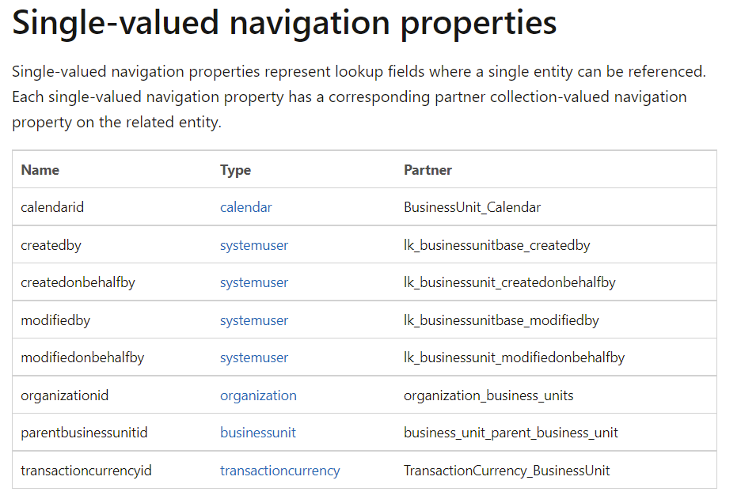

# Using OData syntax in DRM templates

## What are lookup properties
Most dynamics entities will have single-valued 
navigation properties available for updates.

Below are the single valued properties for the business 
unit entity.



What this means in respect to DRM templates is that
there values can be referenced in two different ways.

Sticking with the BusinessUnit entity lets look at
the parentbusinessunitid.

The value for this can be implemented as follows.

The standard way of the property name and value

```json
"parentbusinessunitid": "b98c3796-9ded-4091-bdea-a85b038a8103" 
```

or using odata syntax. From the lookup table above
we can see that parentbusinessunitid references the
businessunit entity that tells us that using odata
syntax the property would look like this.

```json
"parentbusinessunitid@odata.bind": "/businessunits(b98c3796-9ded-4091-bdea-a85b038a8103)" 

```
## Example

It's possible in DRM templates to reference lookup 
properties as you would in a OData call.

Lets take a look at the example resource block below
where we are updating a business unit.

parentbusinessunitid is a look up property or 
Single-valued navigation property on the businessunit
entity and its possible to use the odata.bind 
equivalent.

```json
{ ... 
  "properties": { 
     "businessunits": [ 
        { 
           "businessunitid": "b5ee222r-9f5f-4d7d-9c8e-434e1c627be9", 
           "name": "Test Business Unit", 
           "description": "This is a description of the business unit.", 
           "costcenter": "something", 
           "divisionname": "division test", 
           "emailaddress": "test@demo.com", 
           "parentbusinessunitid@odata.bind": "/businessunits(b98c3796-9ded-4091-bdea-a85b038a8103)" 
       }
     ]
  }
}
```

