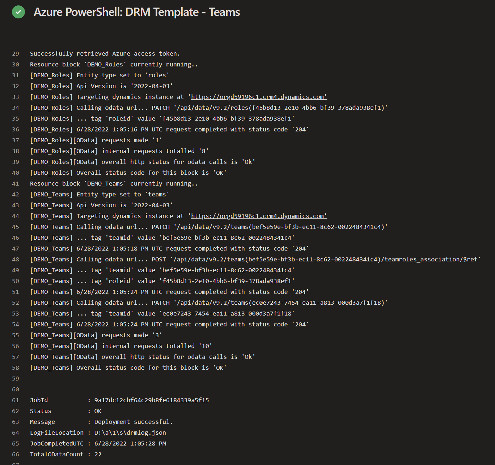

# Using the dependsOn property

Just like in ARM templates we have available to us 
the dependsOn property which allows us to manage the
order in which entities are updated.

In this post we will go through an example of 
updating the role entity before executing the 
team entity updates.

## Dependson Property

The depends on property is a string array. The values
are the full resource names of other resource blocks
within a template.

```json
... },
  "dependsOn": ["drm.crmbaseentity/roles/DEMO_Roles"]
} ...
```

A resource block may have multiple dependencies 
before it should be deployed.

## Example

In the example below we are deploying two resource
blocks. One is a roles update and the other is teams.

We want to ensure the role update is committed 
before the team updates are executed and the 
dependsOn property will force this order.

```json
"resources": [ 
  { 
    "targetenvironment":"[variables('dynamicsCredentials')]",
    "type": "drm.crmbaseentity/roles",
    "apiVersion": "2023-01-09",
    "name": "DEMO_Roles",
    "properties": { 
      "roles":[ 
        { 
          "roleid": "[parameters('drmBusinessManagerRoleId')]", 
          "name": "DRM Business Manager role", 
          "businessunitid":"e6145646-cd42-ea11-a812-000d3a7ed30d" 
        }
      ]
    }
  },
  { 
    "targetenvironment": "[variables('dynamicsCredentials')]",
    "type": "drm.principal/teams", 
    "apiVersion": "2023-01-09", 
    "name": "DEMO_Teams", 
    "properties": {
      "teams": [ 
        { 
          "teamid": "bef5e59e-bf3b-ec11-8c62-0022484341c4", 
          "name": "DRM Business Managers", 
          "businessunitid": "e6145646-cd42-ea11-a812-000d3a7ed30d", 
          "teamroles_association": [ 
             { 
               "roleid": "[parameters('drmBusinessManagerRoleId')]", 
               "drmmetadata": { 
                 "value": "DRM Business Manager role" 
               } 
             }
          ]
        },
        { 
          "teamid": "ec0e7243-7454-ea11-a813-000d3a7f1f18",
          "name": "DRM Finance", 
          "businessunitid": "e6145646-cd42-ea11-a812-000d3a7ed30d" 
        } 
      ]
    },
    "dependsOn": ["drm.crmbaseentity/roles/DEMO_Roles"] 
   }
]
```

If you were running this template in a pipeline 
your output would be in the order it was deployed.


