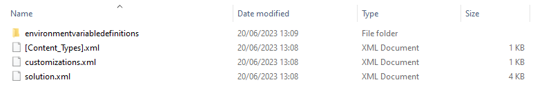
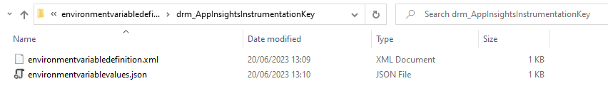

# Set environment variables in an unpacked solution

Use the cmdlet `Set-SolutionEnvironmentVariables` to set environment variable values
in an unpacked solution using environment variable schema names.

Unpack the solution containing environment variables to a folder and pass a hashtable of
variable replacements or use a json file with variable replacements.

## Usage

To execute the command with a hashtable run the command as below

```powershell
Set-SolutionEnvironmentVariables -UnpackedSolutionFolder C:\drmdemo\unpackedSolution -VariableReplacements @{ "new_helloDrm" = "example"; "new_exampleSchemaName"= "Example2"}
```

or to pass a json file

```powershell
Set-SolutionEnvironmentVariables -UnpackedSolutionFolder C:\drmdemo\unpackedSolution -JsonVariableReplacements C:\drmdemo\variablereplacements.json
```

## Unpack a solution

A solution zip containing environment variables extracted to a folder will look like 
below.  It will essentially contain a folder called 'environmentvariabledefinitions'.



Inside this folder will be other folders relating to exported environment variable values.

In this example we only have one and inside the folder for 
'drm_AppInsightsInstrumentationKey' we have the following files.



## How to update environment variables

Once you have an unpacked solution the next thing you need to do is give the cmdlet
a list of variables to update.

This could be a json file that for our example would contain the new value for our 
variable 'drm_AppInsightsInstrumentationKey'.

```json
{
    "drm_AppInsightsInstrumentationKey": "another_demo_guid"
}
```

The json file should be a key/value pair list of environment variable schema names you
want to update.

Another option is to pass a hashtable of key/value pairs

```powershell
-VariableReplacements @{ 'drm_AppInsightsInstrumentationKey' = 'another_demo_guid'}
```

> [!NOTE]
> If the variable does not have a current or default value, it will be added as
the default value.

## Example setup in an ADO pipeline.

In an automated pipeline where you need to update environment variable values before
pushing solutions to environments, you would potentially do it in 3 tasks using the ado
powershell task

1. Unpack the solution
2. Update variables using `Set-SolutionEnvironmentVariables`
3. Package back up the solution

```yaml
steps:
- powershell: |
    Install-Module -Name Drm.Templates.Powershell -force -verbose
    Import-Module -Name Drm.Templates.Powershell -verbose
  displayName: 'PowerShell Install ''DRMTemplates'' Module'

- powershell: |
    <Script to unpack the solution>

- powershell: |
    Set-SolutionEnvironmentVariables -UnpackedSolutionFolder <Location of unpacked solution> -JsonVariableReplacements <Location of json replacements file>
  displayName: 'PowerShell Script Update Config Env Variables'

- powershell: |
    <Script to repack the solution>
```