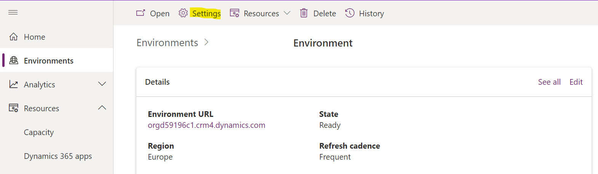
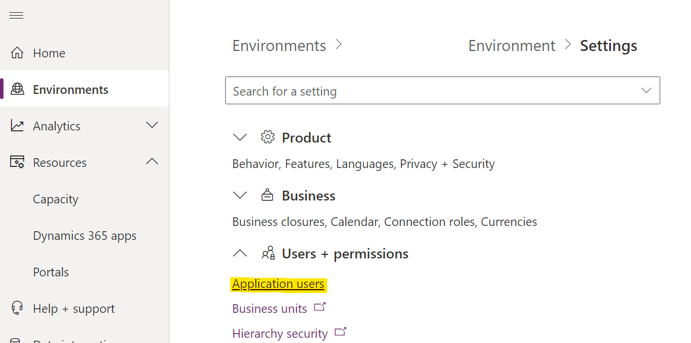
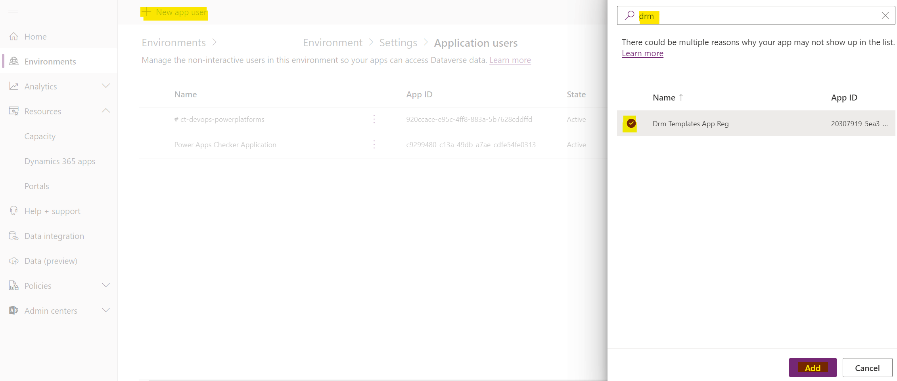

# Connecting to Dynamics with an Azure App Registration

Check out [how DRM templates connect to Dynamics environments here.](xref:target-dynamics-instance)
There are 3 available choices, this walkthrough explains how to use an application 
registration in Azure to connect to a Dynamics instance with a DRM Template.

>[!NOTE]
> In most circumstances you should be able to use an application registration 
to connect to your dynamics instances.  Some interactions with entities may however
require user impersonation during deployment. 
Follow this link for [connecting to a Dynamics environment using user credentials](xref:connect-to-dynamics-with-usercreds)

## Prerequisites

1.  An existing application registration setup in Azure. We will reference this in 
the walkthrough. To [setup an App Reg Connection follow this guide.](xref:setup-app-reg-connection)
2.  A Dynamics environment with system administrator access, this is the environment
 you will deploy the template too.
3. PowerShell with the DRM module installed. Follow this guide to 
[install the powerhsell module](xref:install-powerhsell-module)

## Add your app reg in Dynamics as an App User

The application registration will need to be registered as an Application User in the Dynamics 
environment you are deploying to for the connection to work.

Log into your dynamics environment via the https://admin.powerplatform.microsoft.com/ portal.

Click on Settings



Click on Application Users



Click on New App User and search for the app reg you just created. Then click Add



Now give the app reg the System administrator role and click Create.

Now the app reg has access to your dynamics instance.

## Generate a template

Let's generate a simple template with parameters for the application user details.

Run this PowerShell command to connect to your Dynamics environment

```powershell
connect-crmonline -Username "<useraccount>" -ServerUrl <dynamics url>
```

Now run the command below to generate the template. We will add the 
```-SetupTemplateForAutomation``` switch which will add the parameters we need.

```powershell
New-DrmTemplate -entityName queues -filter '$select=name&$top=1' -SetupTemplateForAutomation
```

>[!NOTE]
> The ```-SetupTemplateForAutomation``` switch makes it easier to generate templates 
that you might want to use in an automation process.

Your template will look something like this.

```json
{
  "$schema": "https://schemas.drmtemplates.io/2021-03-01/deploymentTemplate.json#",
  "contentVersion": "1.0.0.0",
  "parameters": {
    "drmclientId": {
      "type": "string",
      "defaultValue": "00000000-0000-0000-0000-000000000000"
    },
    "drmclientSecret": {
      "type": "string",
      "defaultValue": "00000000-0000-0000-0000-000000000000"
    },
    "dynamicsTenantId": {
      "type": "string",
      "defaultValue": "00000000-0000-0000-0000-000000000000"
    }
  },
  "resources": [
    {
      "targetenvironment": {
        "applicationCredentials": {
          "clientId": "[parameters('drmclientid')]",
          "clientSecret": "[parameters('drmclientSecret')]",
          "tenantId": "[parameters('dynamicsTenantId')]"
        },
        "url": "<your dynamics url>"
      },
      "type": "drm.crmbaseentity/queues",
      "apiVersion": "2023-01-09",
      "name": "GeneratedTemplateFor_queues",
      "properties": {
        "data": [
          {
            "queueid": "33186e2b-9442-4d3b-8c50-cc777c1eeb9f",
            "name": "Application User Queue Demo"
          }
        ]
      }
    }
  ]
}
```

Let's make sure we create a queue on the first run of the template.  Replace the 
```data``` property in your template with the json below

```json
"data": [
          {
            "queueid": "33186e2b-9442-4d3b-8c50-cc777c1eeb9f",
            "name": "Application User Queue Demo"
          }
        ]
```

For each of the parameters ```drmclientId```, ```drmclientSecret``` and ```dynamicsTenantId``` 
replace the ```defaultValue``` with the application registration details.

>[!WARNING]
> We advise not to leave sensitive information like an application registration client secret
> as plain text.
> 
> If this was being used in an ADO pipeline then the client secret could be retrieved from
> an ADO variable or keyvault.

## Deploy the template

To deploy the template run this command

```powershell
New-DrmDeployment -TemplateFile '<absolute path to your template>'
```

Log into your Dynamics environment and search your queues 
for one called ```Application User Queue Demo```

## Next steps

- Learn how to [reference keyvault secrets in parameter files.](xref:reference-keyvault-secrets)