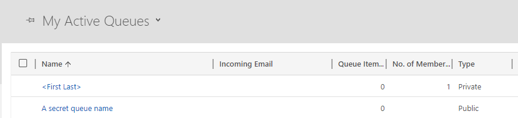

# Reference keyvault secrets in parameter files

Referencing key vault secrets in your parameter files can be useful when you have a
requirement to move sensitive data in your Dynamics environments.

We will walkthrough how to setup your key vault correctly and 
the correct authentication is in place to allow the deployment engine access your keyvault.

## Example parameter file

The ```drmclientSecret``` parameter below is referencing the keyvault ```kv-drm-demo``` and 
will retrieve the secret value for ```DrmClientSecret```

``` json
{ 
   "$schema": "https://schemas.drmtemplates.io/2021-03-01/deploymentParameters.json#", 
   "contentVersion": "1.0.0.0", 
   "parameters": { 
      "dynamicsBaseUrl": { 
        "value": "https://orga59196c1.crm4.dynamics.com"
      },
      "drmclientSecret": { 
        "reference": { 
          "keyVault": { 
             "name": "kv-drm-demo"
          }, 
          "secretName": "DrmClientSecret"
        }
      }
   }
}
```

## Prerequisites

1. You will need an Azure subscription.
2. A Dynamics environment with system administrator access, this is the environment
 you will deploy the template too.
3. PowerShell with the DRM module installed. Follow this guide to 
[install the PowerShell module](xref:install-powerhsell-module)
4. The Azure Az powerhsell module installed. [Follow this guide for installing the Az module](https://learn.microsoft.com/en-us/powershell/azure/install-az-ps?view=azps-9.3.0#other-installation-options)

## Setup your keyvault and access policy

Setting up a key vault and adding secrets is relatively easy. Follow this quickstart 
document from Microsoft on [how to deploy a keyvault and secret in Azure.](https://learn.microsoft.com/en-us/azure/key-vault/general/quick-create-portal)

Once the key vault is in place the next thing to setup is the access policy, this will ensure 
the DRM engine can deploy templates successfully if parameter files are referencing key vault values.

Access to the key vault is performed as part of the ```New-DrmDeployment``` PowerShell cmd. It will 
attempt to fetch a bearer token given the signed in user credentials.  The deployment engine will
use the bearer token to access the keyvault if required.

In the access policy, give the account your connecting to azure, Secret, Get and List
permissions.


Create a new secret in your keyvault called ```drmQueueName``` and set the value to 'A secret queue name'

## Create a template and parameter file

Lets create a template and corresponding parameter file.

This template will create a new queue and fetch the queue name from the keyvault.

Create a file called drmqueue.json and copy the json below.

```json
{
  "$schema": "https://schemas.drmtemplates.io/2021-03-01/deploymentTemplate.json#",
  "contentVersion": "1.0.0.0",
  "parameters": {
    "secretQueueName": { 
      "type": "securestring"    
    }
  },
  "resources": [
    {
      "targetenvironment": {
        "bearerToken": "<Enter token here>",
        "url": "<Your Dynamics URL>"
      },
      "type": "drm.crmbaseentity/queues",
      "apiVersion": "2023-01-09",
      "name": "KeyvaultDRMDemo_queues",
      "properties": {
        "data": [
          {
            "queueid": "1042099f-10ff-4959-b922-7c9fb1299278",
            "name": "[parameters('secretQueueName')]"
          }
        ]
      }
    }
  ]
}
```

Create a file called drmqueue.params.json and copy the json below.

```json
{ 
   "$schema": "https://schemas.drmtemplates.io/2021-03-01/deploymentParameters.json#", 
   "contentVersion": "1.0.0.0", 
   "parameters": { 
      "secretQueueName": { 
        "reference": { 
          "keyVault": { 
             "name": "<your keyvault name>"
          }, 
          "secretName": "drmQueueName"
        }
      }
   }
}
```

Replace the string ```<your keyvault name>``` with the name of your keyvault.

## Deploy the template

Before we deploy we will need to paste into the template a bearer token.

In PowerShell run the command below. Replace ```<dynamics url>``` with the url of the Dynamics
environment we will be deploying too.

```powershell
Connect-Crmonline -Username "<useraccount>" -ServerUrl <dynamics url>
```

Run the command below to get the bearer token and copy it into the template by replacing the 
text ```<Enter token here>```.

```powershell
$conn.CurrentAccessToken
```

Replace ```<Your Dynamics URL>``` with the url of the Dynamics environment in the template.

Now lets connect to Azure with the same account that was setup in the keyvault access policy.

```powershell
Connect-AzAccount -TenantId <Your Azure tenantid>
```

>[!NOTE]
> Switch to the correct subscription if you have more than one by using Set-AzContext

Next run the following command to deploy the template with parameters.

```powershell
New-DrmDeployment -TemplateFile '<absolute path to the template file>' -TemplateParameterFile '<absolute path to the parameters file>'
```

Log into your Dynamics environment and check for a queue called 'A secret queue name'




## Running Templates in Pipelines

To run templates in your ADO pipelines run the PowerShell 
cmd using an [Azure PowerShell task](https://learn.microsoft.com/en-us/azure/devops/pipelines/tasks/reference/azure-powershell-v5?view=azure-pipelines).

In ADO setup a an Azure service connection and reference this in your task.

```yaml
- task: AzurePowerShell@5 
  displayName: 'Azure PowerShell: DRM Template - Business Units' 
  inputs: 
    azureSubscription: 'DRM Dev Connection' 
    ScriptType: InlineScript 
    Inline: | 
        Install-Module -Name Drm.Templates.Powershell
        New-DrmDeployment -TemplateFile '$(System.DefaultWorkingDirectory)\platform-drm-demo\templates\demo_businessunits.json' -TemplateParameterFile '$(System.DefaultWorkingDirectory)\platform-drm-demo\parameters-stg\demo_businessunits.params.json'
   
  azurePowerShellVersion: LatestVersion
```

To [setup a new azure service connection follow this Microsoft document.](https://learn.microsoft.com/en-us/azure/devops/pipelines/library/service-endpoints?view=azure-devops&tabs=yaml)

Once the principle is in place then you just need to give the principle 
key vault secret Get and List permissions.


## Next Steps

Learn [how to setup an ADO repository](xref:deploy-drm-ado-pipelines-with-params)

Also check this document out on the @drm-parameter-file.