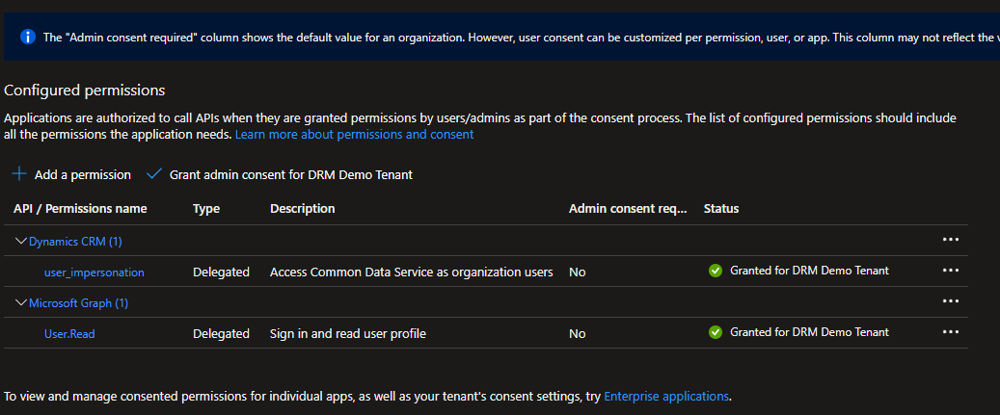

# Setup Application Registration connection

The most common way of connecting to your dynamics instances will be using an application 
registration in Azure.

This post will explain how to set this up and provide examples of how to use the 
app reg in your templates.

## Prerequisites

You will need an Azure subscription for application registration. A trial account will also work.

## Create the Application Registration in Azure

Lets create the application registration in your Azure tenant by following the
instructions here 

https://docs.microsoft.com/en-us/power-apps/developer/data-platform/walkthrough-register-app-azure-active-directory#create-an-application-registration

> [!NOTE]
> To use user credentials when connecting to a Dynamics environment, admin consent
would need to be granted to the api permissions.

## Set up the application registration for use with user credentials.

To use user credentials in templates for connecting to Dynamics environments admin consent 
would need to be granted on the api permissions.

## Next Steps

- [Connecting to Dynamics using a Bearer token](xref:connect-to-dynamics-with-app-registration)
- [Connecting to Dynamics with an Azure App Registration](xref:connect-to-dynamics-with-app-registration)
- [Connecting to Dynamics using User credentials](xref:connect-to-dynamics-with-usercreds)